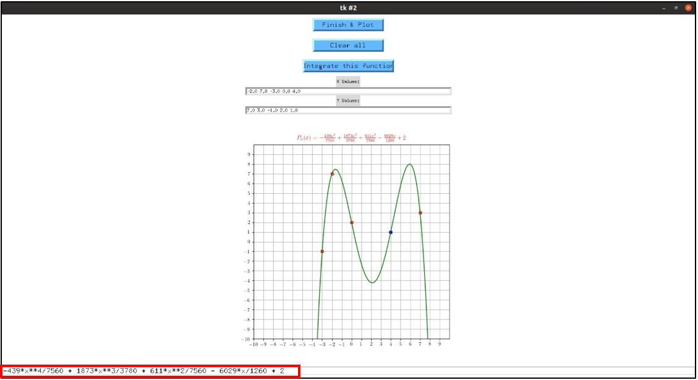

# Projet:  Analyse Numérique 

# - Réalisé par: 

## 
 Ichrak Gara & Bacem Abroug 

_________________________________
________________________________
____________________________

# - Classe:  
## 
2DNI_G2 

# I. Objectif: 

Notre objectif principal du projet est de développer et d'implémenter une **`interface graphique`** à utiliser pour **`interpoler`** une fonction sous la forme d'une courbe tout en **`intégrant`** simultanément une intégrale assez complexe dans une forme polynomiale.

# II. Introduction Générale de l'analyse Numérique: 

L'analyse numérique, c'est une **`branche des mathématiques`**, des mathématiques appliquées, dont le but est de :
- mettre au point et d'étudier des méthodes de résolution numérique.
- calculer véritablement des nombres qui vont représenter des phénomènes physiques

Pour **`résoudre numériquement des équations`** qui sont issues de problèmes posés par la physique ou par les sciences appliquées.

L’analyse numérique a commencé bien avant la conception des ordinateurs et leur utilisation quotidienne que nous connaissons aujourd’hui.

Les premières méthodes ont été développées pour essayer de trouver des **`moyens rapides`** et **`efficaces`** de s’attaquer à des problèmes soit **`fastidieux`** à résoudre à cause de leur **`grande dimension`** (systèmes à plusieurs dizaines d’équations par exemple), soit parce qu’il n’existe pas solutions explicites connues même pour certaines équations assez simples en apparence.

# III. Motivation: 

- Recherche et développement : études expérimentales coûteuses
- Les modèles considérés sont composés d’ensemble d’équations dont on ne sait pas déterminer de solutions explicites
- Proposer une solution approchée, calculée à l’aide de l’ordinateur.

En analyse numérique on s’intéresse sur la mise en pratique des méthodes permettant de résoudre, par des calculs purement numériques, des problèmes d’analyse mathématique. c'est pour cela nous nous intéressons dans notre projet sur 
l'interpolation polynomiale et l'intégration numérique qui résoudront le problème de calcule.

# IV. Interpolation: 

En analyse numérique, l'interpolation est une opération mathématique permettant de remplacer une courbe ou une fonction par une autre courbe (ou fonction) plus simple, mais qui coïncide avec la première en un nombre fini de points (ou de valeurs) donnés au départ.

=> elle désigne la construction d’une courbe à partir de la donnée d’un nombre fini de points.

il existe différents types de l'interpolation:

- Interpolation linéaire.
- Interpolation cosinus. 
- Interpolation polynomiale.
- Interpolation polynomiale par parties.

## 1. Interpolation polynomiale: 

Une interpolation polynomiale consiste à utiliser un polynôme unique, de degré aussi grand que nécessaire, pour estimer localement l'équation représentant la courbe afin de déterminer la valeur entre les échantillons.

## 2. Principe: 

Pour représenter une fonction en informatique, on prend en général « un certain nombre » de points et l'on fait une interpolation polynomiale, ce qui évite de calculer trop de points. Se pose alors la question du choix des points.

Dans un premier temps, on peut prendre des points régulièrement répartis dans l'intervalle. Cependant, cela peut donner des « effets de bord » (le polynôme représente bien au milieu de l'intervalle, mais a un comportement différent aux bords bien que passant par les points), et pose problème dans les endroits où les variations de pente sont importantes.

Pour éviter les effets de bord, on utilise des points répartis selon une fonction sinusoïdale.

  

Pour chaque intervalle, on calcule la différence entre le polynôme et la fonction au point médian, et si cet écart est supérieur à un seuil de tolérance, on rajoute un point au milieu de l'intervalle.

Les différents interpolations qu'on peut utiliser pour interpoler I sont :
- **`Interpolation de Lagrange`**
- **`Interpolation de Newton`**

# V. Intégration: 

En mathématique, l'intégration est une opération consistant à calculer l'intégrale d'une fonction d'une ou plusieurs variables.

## 1. Intégration Numérique: 

Dans certains cas très limités, une telle **`intégrale`** peut être calculée analytiquement (à la main). Cependant, ce n’est que très rarement possible, et le plus souvent un des cas suivants se présente :
- Le calcul analytique est long, compliqué et rébarbatif
- Le résultat de l’intégrale est une fonction compliquée qui fait appel à d’autres fonctions elles-même longues à évaluer
- Cette intégrale n’a pas d’expression analytique
Dans tous ces cas, on préfèrera calculer **`numériquement la valeur de l’intégrale I`**.

## 2. Principe: 

L’idée principale est de trouver des méthodes qui permettent de calculer rapidement une valeur approchée I de l’intégrale à calculer tel que:

  

Les méthode qu'on va utiliser pour calculer l'intergrale I sont :
- **`Méthode des réctangles`**

  

- **`Méthode du point milieu`**

  

- **`Méthode des trapézes`**

  

- **`Méthodes de Simpson`**

  

# VI. Environnement de travail: 

En fait **`L'interface utilisateur graphique (GUI)`** est une forme d'interface utilisateur qui permet aux utilisateurs d'interagir avec les ordinateurs via des indicateurs visuels utilisant des éléments tels que des icônes, des menus, des fenêtres, etc.

Le langage de programmation que nous avons utilisé dans notre projet: c'est le langage **`Python`** en utilisant le module **`Tkinter`**

  

#### Qu'est-ce que Tkinter?

  

**`Tkinter`** est le module python intégré utilisé pour créer des applications GUI. C'est l'un des modules les plus couramment utilisés pour créer des applications GUI en Python car il est **`simple`** et **`facile`** à utiliser.

Pour créer une application tkinter:

- Importer le module - tkinter
- Créer la fenêtre principale (conteneur)
- Ajoutez n'importe quel nombre de widgets à la fenêtre principale
- Appliquez l'événement Trigger sur les widgets.

# VII. Réalisation et Validation: 

Dans cette partie, nous allons présenter les différentes interfaces de notre projet qui se compose de 3 interfaces graphiques:
- **`Interface générale pour la sélection de l'utilisateur`**
- **`Interface pour implémenter des interpolations polynomiales`**
- **`Interface pour implémenter l'intégration numérique`**

## 1. Interface 1: 

  

    
Cette interface contient 3 boutons:
    
- **`Bouton "Interpolation polynomiale"`**: Ce bouton affiche une nouvelle interface qui interpole les points dans une 
    
    courbe et montre également le polynôme Pn (X).
    
    
- **`Bouton "Intégration numérique"`**: Ce bouton affiche une autre interface qui intègre une fonction en spécifiant divers paramètres à suivre.
    
    
- **`Bouton "Quitter"`**: qui permet de fermer toutes les interfaces.

## 2. Interface 2: 

  

  

    
- Cette interface comprend principalement **`deux zones de texte`**. Nous pouvons saisir les valeurs x et y que nous interpolerons sous la forme d'un **`polynôme Pn (x)`** et une courbe pour ce polynôme en utilisant le bouton **`"finish & plot"`**. 
    
    
- Sinon, nous construisons les points x et y directement sur la courbe et on affiche le polynôme directement.
    
    
 
- Ce polynôme est également affiché en bas de la fenêtre (encadré en rouge dans la figure ci-dessus) ou le cas où 
    l'utilisateur veut copier le polynôme...
    
    
- Nous pouvons également afficher la valeur de l'intégrale de cette fonction en utilisant le bouton **`"Integrate this function"`** , qui **`affiche la valeur intégrale`** sous forme de petite fenêtre comme illustré dans la figure 2 ci-
    dessus avec une représentation graphique de la courbe intégrer avec la méthode des trapézes.
    

    
- Et le dernier bouton est **`"Clear all"`** qui **`efface`** tous les paramètres et peut reconstituer pour une autre 
    fonction.

## 3. Interface 3: 

  

  

     
- Cette interface permet **`l'intégration d'une fonction f`** spécifique en spécifiant des paramètres tels que 
    **`l'intervalle [a, b]`** de la fonction, **`la méthode d'intégration`** (méthode des trapéses, méthode Simpson,
    méthode rectangle ou méthode point milieu) et **`la valeurs N`** (nombre des points ou les échantillons)
    
    
- Cette intégration apparaît sous forme de **`représentation graphique`** à l'aide du bouton **`"plot & integrate function"`** 

# Simulation: 

#### Nous avons simulé notre travail sous forme de GIF ci-dessous pour mieux comprendre le flux des boutons et l'affichage des courbes.

## Simulation pour l'interface d'interpolation: 

  

## Simulation pour l'interface d'intégration: 

  

